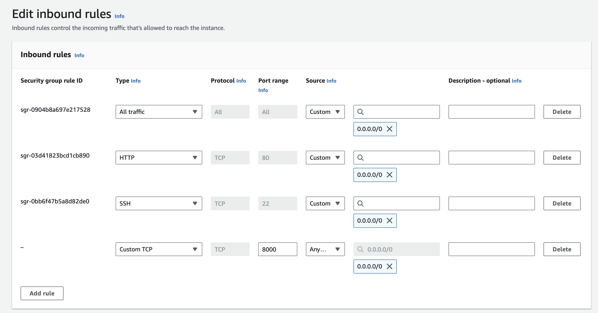

# datacamp-titanik
DataCamp 2023 Uçtan Uca Makine Öğrenmesi Modelleri &amp; FastAPI &amp; Docker Workshop Kodları

# Docker Image Build & Çalıştırma

Gerekli Docker kurulumları yapıldıktan ve kodlar makineye indirildikten sonra
```
# Kodların makineye indirilmesi
git clone https://github.com/yemregundogmus/datacamp-titanik.git

# Docker image build
docker build -t titanik-app:v1 .

# Docker image run
docker run -d -p 8000:8000 titanik-app:v1
```

İşlemlerden sonra localhost:8000/docs adresinden uygulamaya erişilebilir. 

# AWS üzerinde Canlıya Alma

- AWS üzerinde uygulamanın canlıya alınabilmesi için öncelikle [AWS EC2](https://us-east-1.console.aws.amazon.com/ec2/) servisi üzerinden 1GB RAM 1VCPU'ya sahip bir makine açılması gerekmektedir. Makine tipi olarak ücretsiz olduğu için t2.micro tercih edilebilir. 
- Ayarlar yapılırken security group ayarında bütün portlar(önerilmez veya fastapi uygulamasının yayınlanacağı porta erişim verilmesi gerekmektedir. Ayarlar ekteki görseldeki gibi yapılmalıdır.
  - 
- Makine açıldıktan sonra makineye ssh veya ec2-serial-console kullanılarak erişilebilir.
- Amazon makineleri yüksek ihtimalle python3 yüklü olarak gelmektedir. Eğer gelmediyse internet üzerinden Debian/Linux makinelere nasıl python yükleneceğine bakabilirsiniz.
- Makineye gerekli kodların çekilebilmesi için git yüklenir. 
```
# Root Yetkilerinin Alınması
sudo su

# AWS AMI
yum install git -y
yum install docker -y

# Docker servisinin restartlanması
systemctl restart docker
```

- Git yüklendikten sonra alttaki komut ile kodlar makineye çekilir.
```
git clone https://github.com/yemregundogmus/datacamp-titanik.git
```

- Dosyaya gidilerek docker image'i build edilir.

```
cd datacamp-titanik

docker build -t titanik-app:v1 .
```

- Build edilen docker image'i run edilir.
```
docker run -d -p 0.0.0.0:8000:8000 titanik-app:v1
```

Uygulama çalışınca makinenin public ipsinin 8000 portundan erişilebilir. 

```
# Örnek IP
X.X.X.X:8000/docs
```
